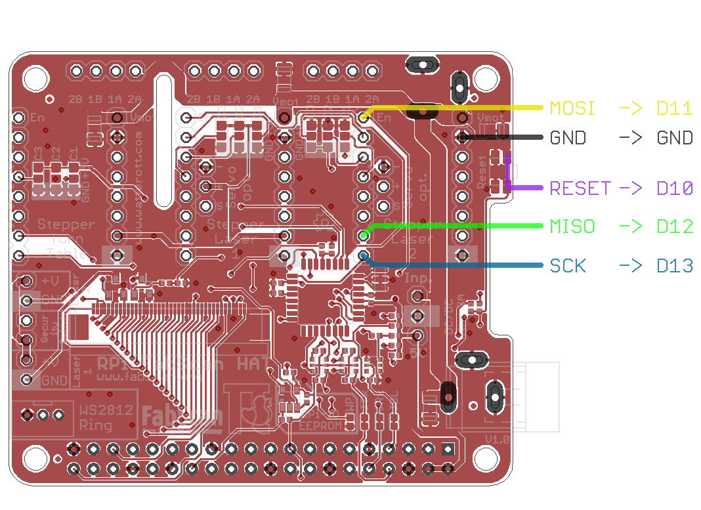
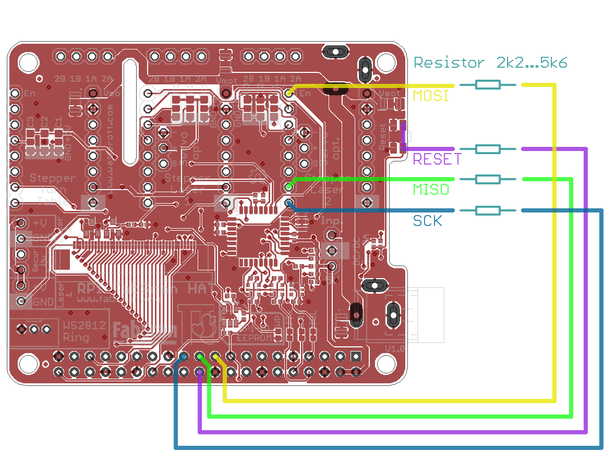

**[Software](#software)**

**[Hardware](#hardware)**

**[Scanning Issues](#scanningIssues)**

**[Other](#other)**

------

#### Software<a name="software"></a>

- What username and password do I need for login the FabScanPi?

  The username / password is the same as in the standard raspbian configuration: 

  Username: **pi**

  Password: **raspberry**


- There is no preview video visible in the menu.

  There is no video - only a black area, maybe a turning hour glass visible. That is a known problem of some browsers but will have not effect the scanner's function. This bug will be fixed in the future.

  ​

- Where can I find the config file?

  You can find it in the folder: ```/var/log/fabscanpi```

  The config file is named : ```fabscanpi.log```

  ​


- How can I view the log file?

  You can see the log file on screen by typing:

  ```cat /var/log/fabscanpi/fabscanpi.log```

  ​


-   How can I edit the log file?

  You can edit the log file with the nano editor by typing:

  ````sudo nano /var/log/fabscanpi/fabscanpi.log```

  To save the file press "Ctrl+O" followed by "enter".

  To exit the nano editor press "Ctrl+X".


- How can I stop / start the FabScanPi server?

  You can stop the server from the console by typing:

  ```sudo /etc/init.d/fabscanpi-server stop```

  or to (re) start:

  ```sudo /etc/init.d/fabscanpi-server stop```

------

#### Hardware<a name="hardware"></a>

-  What power source(s) do I need to get my FabScanPi working?

   The FabScanPi will need 12V DC and 5V DC. There are different options to fulfil this requirement:


**Option A:** Connect 12V DC to the HAT (round connector) and install a 12V DC - to - 5V DC regulator on the designated space on the HAT. 

NOTE: For details and specifications please consult the hardware chapter.


**Option B:** Connect 12V DC to the HAT (round connector) and 5V DC to the raspberry (micro USB 								connector). 

NOTE: Make sure you switch on the both power sources at the same time to avoid software trouble.


**Option C:** Connect 12V DC to the HAT (round connector) and connect a 5V DC power source to the 5V pin regulator pin on the HAT. 

NOTE: For details and specifications please consult the hardware chapter.


- What is the rotating direction of the scan table?

  It should move clockwise – if not please consult the hardware chapter of our documentation and check the connection of your stepper.


- Which camera will work?

  FabScan Pi can be built with both Raspberry Pi Camera Modules V 1.x or V 2.x.


- Is the LED-Ring / PCB-board with LEDs mandatory?

  Yes, because the light is needed to perform the calibration. It is also necessary to archive good quality texture scans.


- Which LED-ring is compatible?

  Any ring using WS2812B LEDs (or compatible) will do. To avoid problems with the calibration we suggest using the FabScanPi LED-board.


- I have a Raspberry Cam Module with NoIR. Can I use it?

  There’s no advantage in using the NoIR cam. The algorithms for the laser detection are made for the normal cam. Therefore we recommend to use the normal camera modules.


- No connection to Arduino, how can i fix that?

  First you need to find out more about the problem. Have a look to the log file (see "How can i view the log file?" in F.A.Q.). 
  Find the section where the init sequence of the server starts. Look for the folowing line ... 
  
  ```
  fabscan.server - INFO - FabScanPi-Server 0.4.2
  ```
  
  If the next lines look like the the debug output below, the fabscanpi-server is not able to flash the firmware 
  to the FabScanPi-HAT (or Arduino).

	fabscan.scanner.laserscanner.FSSerial - ERROR - No FabScanPi HAT or compatible device found on port /dev/ttyAMA0
   
	fabscan.scanner.laserscanner.FSSerial - ERROR - Fatal FabScanPi HAT or compatible connection error....
	
	fabscan.scanner.laserscanner.FSHardwareController - DEBUG - Reset FabScanPi HAT...
	
	fabscan.scanner.laserscanner.FSSerial - ERROR - 'NoneType' object has no attribute 'write'
	
	fabscan.scanner.laserscanner.FSSerial - DEBUG - 'NoneType' object has no attribute 'readline'
	
	fabscan.scanner.laserscanner.FSSerial - ERROR - 'NoneType' object has no attribute 'write'


  If this error occurs by the first run please start reading with 1. In case this error occurs after an fabscanpi-server update 
  and your software worked before, continue reading with 2. 
  	
  1. First double check the solder joints of the 40-pin Header of the FabScanPi-HAT. If you are sure that there are no 'cold' solder joints move on 
  reading, otherwise resolder those joints. Try again and have a look to the logs. If the error still occurs continue reading.
  
  2.
  
  
  
  
------

#### Scanning issues<a name="scanningIssues"></a>

- The turntable is jerking during the scan process what can I do?

  This behavior is quite normal because every time a new image has been shot the table just moves to the next position. If the table is turning smoothly (clockwise) during scan preview everything should be fine.


- My scan is cut-off on top and / or bottom. What can I do?

  Try to optimize your scan results by measuring the "origin_distance" of your calibration sheet. Correct the value in the configuration. Make sure the size of the black squares on your calibration sheet as the same as "square_size" in the calibration file.


- The texture scan is mirror-inverted.

  Check the rotating direction of your turntable (and the connection of the stepper motor). Check and adjust your config-settings for the “dimension”-value.


- The laser cannot be detected.

  Make sure your laser adjustment is correct. The laser must pass the scanning table right through the center. If no object is on the table the laser should be visible in the preview image (on the rear wall close to the left border of the image).


- The scans don’t have the same shape as the original.

  Check if your laser is aligned in vertical direction. Do another calibration.


- Calibrations fails / no "Calibration finished" message is displayed

  Check the starting position of the calibration sheet and make sure your box is closed during the scan. The calibration sheet must be placed with a black square in the upper left corner.


------

#### Other<a name="other"></a>

tbd.
