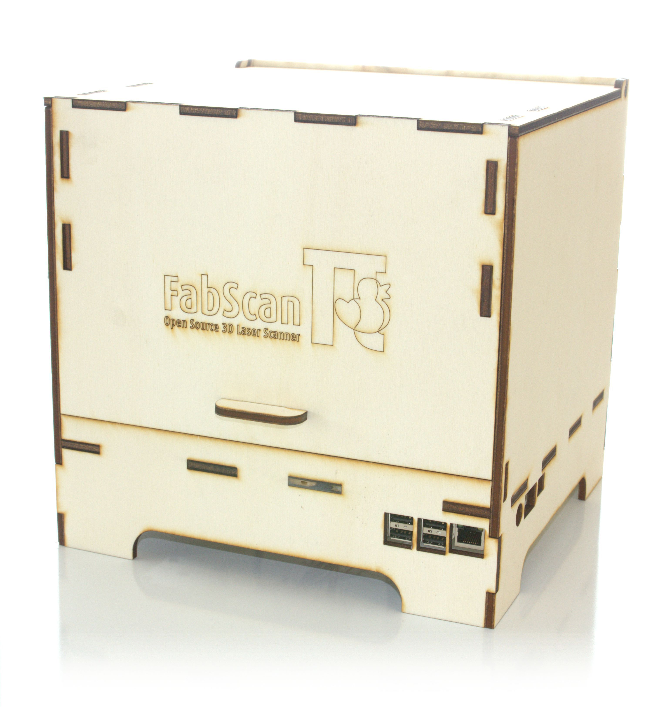
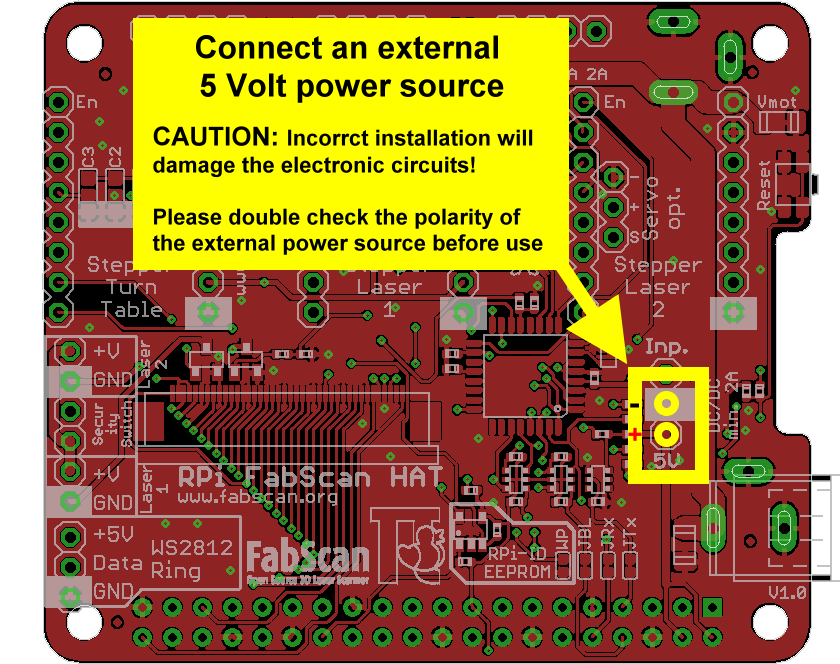

#Bill of Materials
- Raspberry Pi 2 or Raspberry Pi 3
- [Stepper Motor, NEMA 17 type, 1.8° step angle (200 steps/revolution)](http://www.watterott.com/en/Stepper-Motor-Unipolar/Bipolar-200-Steps/Rev-42x48mm-4V-1200mA)
- [Pololu Universal Aluminum Mounting Hub for 5mm Shaft](http://www.watterott.com/en/Pololu-Universal-Aluminum-Mounting-Hub-for-5mm-Shaft-M3-Holes-2-Pack)
- Motor driver ([Silent Step Stick](http://www.watterott.com/en/SilentStepStick-with-Pins) recommended)
- [5V red line laser module](http://www.watterott.com/en/5mW-Laser-Module-emitter-Red-Line)
- [9g Servo Motor](http://www.watterott.com/en/Servo-HS-53) (not supported by the software now)
- [FabScanPi HAT](http://www.watterott.com/en/RPi-FabScan-HAT) for Raspberry Pi
- [12V to 5V switching regulator](http://www.watterott.com/de/CUI-V7805-2000-StepDown-5V/2A)
- [Raspberry Pi camera V2](http://www.watterott.com/en/Raspberry-Pi-Camera-v2)
- [Raspberry Pi Camera Connection Cable - 50cm](http://www.watterott.com/en/Raspberry-Pi-Camera-Connection-Cable-50cm)
- [FabScanPi Camera Mount](http://www.watterott.com/index.php?page=product&info=4930) with LED ring
- [FaBScanPi Case](http://www.watterott.com/en/FabScan-Pi-Housing-Parts)
- [Screw Set](http://www.watterott.com/en/FabScan-Pi-Screw-Set) or see the [Screws and Washers](#screws-and-washers) table
- [1x 12V / 2A power supply](http://www.watterott.com/en/Power-Supply-12V-2A)

#How to Assemble the Cabinet
The laser cut files can be found at [https://github.com/mariolukas/FabScan-Case](https://github.com/mariolukas/FabScan-Case)

<iframe width="560" height="315" src="https://www.youtube.com/embed/W9KgYL7sZN0" frameborder="0" allowfullscreen></iframe>

#The FabScanPi HAT
**General description**

The FabScan HAT is basically a combination of an Arduino and the old
FabScan Shield for Arduino. It provides all connectors for the hardware
parts (like motors, servos, lasers, LED's etc.) Instead of an USB 
connection to the Raspberry Pi, the HAT is put on the Pi's pinheaders.
The HAT communicates over a serial connection with the Rasperry Pi. 
(GPIO14 and GPIO15 of the Raspberry Pi). The firmware and also updates are 
flashed automatically by the FabscanPi-Server application.

**How to Assemble the FabScanPi HAT**

* * *
<i class="fa fa-info-circle spacer" aria-hidden="true"></i> _About Soldering_
 
_If you are soldering for the very fist time, we suggest to read the comic ["Soldering is Easy"](https://mightyohm.com/files/soldercomic/FullSolderComic_EN.pdf) by Mitch Altman (soldering wisdom), Andie Nordgren (comic adaption) and Jeff Keyzer (layout and editing)._
* * *

The FabScanPi HAT will be delivered with the main components already assembled. You only need to install the headers and connectors which fit your demand.

Let's start with the female 8-pin headers for the stepper motor controllers. First the two headers which are designated with "Stepper Turn Table". Put one in and flip the pcb to solder the pins on the rear side. Solder one pin first and make sure the header is still in the correct position. A "third hand" tool or a pcb-holder are very helpful for this job.

Now you can select between three options

- **Option A:** Two stepper motor ports for the laser adjustment or

- **Option B:** Two servo connector ports for the laser adjustment or

- **Option C:** Two stepper and two servo connector ports for the lasers (additional headers required) 

  ​

**Option A:**

Use the remaining four 8-pin femal pin headers and install them on the pcb. You can now use the HAT with three stepper motors (1x turn table, 2x laser control)

**Option B:**

Use an electronics wire cutter to cut off two 3-pin male headers from the long male-header. Put them into the pinholes labeled "Servo opt." You can now use the HAT with one stepper motors (1x turn table) and two servos (2x servo opt.).

**Option C:**

If you are unsure about using servos or stepper motors you can install both. Therefore you'll need to buy four 8-pin female headers which are at least 8 mm of height. Install them at the pinholes for the "Stepper Laser 1 and 2". Also cut off two 3-pin male headers from the long male-header. Put them into the pinholes labeled "Servo opt." Now you can use either servo controllers nor the connectors for the servos.

**Connector for the LED-Ring**

The next connector is the JST connector for the RPi-RingLight. Make sure the direction is correct. Fix it and solder the three pins on the rear side of the PCB.

**Connectors for the stepper motors**

Here you can use the three 4-port screw terminals if your stepper cables have no connector plug. 

If the stepper motor cables have an 4-pin female connector you can use three 4-pin male headers (to be cutted off from the long header).

**Connector for Laser(s) and Laser safety switch**

The next connector to be installed is the 6-port screw terminal. It must be soldered into the corresponding pin holes between the JST connector and the 8-pin female header for the table stepper. Later this 6-port terminal will be used to connect the Laser(s) and the Laser safety switch.

**Power Connector** (DC- jack)

Now the DC-jack power connector will be installed into three oval pin holes close to the 2x20-pin socket header. Soldering is done from the rear side of the PCB.

**Assembling the Raspberry-Pi Connector**

Now the 2x20-pin socket connector must be installed from the rear side of the PCB (where we only did soldering till now). Soldering of the 2x20-pin connector is done on the front side (where all our parts are placed). This connector is used as interface for the Raspberry-Pi.

**Mount the 5V DC/DC converter or 5V external Power Source**

Additionally to the 12V DC coming from the power supply the FabScanPi needs 5V DC. Now you have to decide if you want to use a DC/DC converter IC which generates the 5V out of the 12V from the external 12 power supply (common solution). 

For the DC/DC converter option you can find further instructions and pictures on the [Watterott electronic website](https://github.com/watterott/RPi-FabScan-HAT/blob/master/hardware/RPi-FabScan-HAT_Assembly.pdf).

If you are using another power supply which is capable of delivering 12V and 5V DC you can connect it as well. Details can be found [here](#5V-EXT).

#Connecting the Stepper Motor(s)

There are different kinds of stepper motos. Mostly with 4 or 6 leads. For
connecting the stepper motor to the FabScanPi HAT you need to know the
corresponding lead pairs of the motor coils. The best way to find out something
about the motor is to have a look at the datasheet of the motor manufacturer.
In the following desciptions the pairs are called (1A, 1B) and (2A, 2B).

 

There are several ways to find the pair wires without a datasheet. Some of them
are described here:

**Method with an ohm-meter**

Simply measure pairs of wires for their resistance. If the resistance is a few ohms 
( < 100 Ω) only, you've found a pair. The other two wires should make up the other pair.

**Methods without an ohm-meter**

First, try turning the motor with your fingers, and notice how hard it is. Then, 
stick wires together in pairs. If the motor turns noticeable harder, you've found a pair.
Another method is to use an LED, hold any two wires to the ends of a LED and turn the 
motor (twiddle in both directions), the LED will light if the wires are a pair, 
swap wires until you light the LED.

#Connecting the Lasers

The FabScanPi HAT provides connectors for two lasers. But only one laser
is supported until now. Connect your laser to the connectors labeled
with ...

**Safety switch**

There is the possibility to add a laser safety switch which disables the laser
when the lid is opened. The FabScanPi HAT provides a connector for such a switch.
If you don't need a switch you still have to bridge this connector with 
a cable to get the lasers work. (left image: with bridged connector, 
right image: connecting a switch)

#Connecting the Motor drivers

TODO

#Connecting the Power Supply
The FabScanPi will need 12V DC and 5V DC. There are different options to fulfil this requirement:

**Option A: ** (recommended)
Connect 12V DC to the HAT (round connector) and install a 12V DC - to - 5V DC regulator on the designated space on the HAT. Make sure the 5V power regulator can provide a current of min. 2.0A

for 1 turntable stepper motor, 1 PiCam and 1 laser.

| Pin label      | Description                              |
| -------------- | ---------------------------------------- |
| Inp.           | 12V from HAT as input for regulator      |
| (white square) | Ground (GND)                             |
| 5V             | 5V output from regulator to FabScanPi HAT |

For the DC/DC converter option you can find further instructions and pictures on the [Watterott electronic website](https://github.com/watterott/RPi-FabScan-HAT/blob/master/hardware/RPi-FabScan-HAT_Assembly.pdf).

NOTE: For the final stage of constuction a more powerful power supply is needed. At the moment there are no technical specifications available.

**Option B:** 

Connect 12V DC to the HAT (round connector) and 5V DC to the raspberry (micro USB connector). 

NOTE: Make sure you switch on the both power sources at the same time to avoid software trouble.

**Option C:** 

Connect 12V DC to the HAT (round connector) and connect a 5V DC power source to the 5V pin regulator pin on the HAT. Make sure the 5V power source can provide a current of min. 2.0A for

1 turntable stepper motor, 1 PiCam and 1 laser.

| Pin label      | Description                          |
| -------------- | ------------------------------------ |
| (white square) | Ground (GND)                         |
| 5V             | Output from external 5V power source |

NOTE: For the final stage of constuction a more powerful power supply is needed. At the moment there are no technical specifications available. Make sure you switch on the both power sources at the same time to avoid software trouble.

#Connecting the LED Ring
TODO

#Additional Motors for the Lasers
TODO

#Screws and Washers

Even if you use the srew set from Watterott, as given in the *BOM*, here is the the usage reference:

**Screws**

| Type | Length | Qty  | Usage                   |
| ---- | ------ | ---- | ----------------------- |
| M2   | 16     | 2    | Servo Hitec-HS53        |
|      |        | 2    | Security Switch         |
|      |        | 1    | 5mW line Laser red      |
| M2.5 | 15     | 4    | RaspberryPi             |
| M3   | 10     | 4    | Stepper motor           |
|      |        | 4    | RPi-RingLight           |
|      |        | 4    | Turn-table Mounting Hub |

**Washers**

| Type    | Heigth | Qty  | Usage         |
| ------- | ------ | ---- | ------------- |
| 3.4/4.5 | 1      | 4    | Stepper motor |
| 2.5/4.5 | 3      | 4    | RaspberryPi   |
