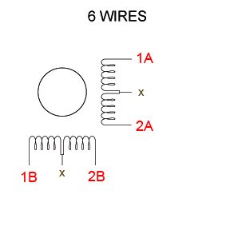
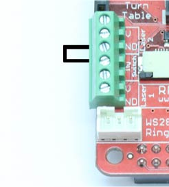
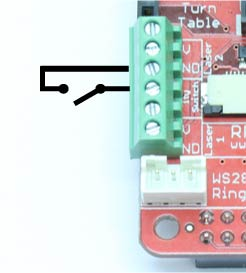

#Bill of Materials
- Raspberry Pi 2 or Raspberry Pi 3
- Stepper Motor 1.8° step angle (200 steps/revolution)
- Pololu Universal Aluminum Mounting Hub for 5mm Shaft
- Motor driver ([Silent Step Stick](http://www.watterott.com/de/SilentStepStick) recommended)
- 5V red line laser module
- 9g Servo Motor (not supported by the software now)
- [FabScanPi HAT](http://www.watterott.com/en/RPi-FabScan-HAT) for Raspberry Pi
- [FabScanPi Camera Mount](http://www.watterott.com/index.php?page=product&info=4930) with LED ring
- [FaBScanPi Case](http://www.watterott.com/en/FabScan-Pi-Housing-Parts)

#How to Assmble the Cabinet
The laser cut files can be found at [https://github.com/mariolukas/FabScan-Case](https://github.com/mariolukas/FabScan-Case)

#The FabScanPi HAT
The FabScan HAT is basically a combination of an Arduino and the old
FabScan Shield for Arduino. It provides all connectors for the hardware
parts (like motors, servos, lasers, LED's etc.) Instead of an USB 
connection to the Raspberry Pi, the HAT is put on the Pi's pinheaders.
The HAT communicates over a serial connection with the Rasperry Pi. 
(GPIO14 and GPIO15 of the Raspberry Pi). The firmware and also updates are 
flashed automatically by the FabscanPi-Server application.

#Connecting the Stepper Motor
There are different kinds of stepper motos. Mostly with 4 or 6 leads. For
connecting the stepper motor to the FabScanPi HAT you need to know the
corresponding lead pairs of the motor coils. The best way to find out something
about the motor is to have a look at the datasheet of the motor manufacturer.
In the following desciptions the pairs are called (1A, 1B) and (2A, 2B).

 

There are several ways to find the pair wires without a datasheet. Some of them
are described here:

**Method with an ohm-meter**

Simply measure pairs of wires for their resistance. If the resistance is a few ohms 
( < 100 Ω) only, you've found a pair. The other two wires should make up the other pair.

**Methods without an ohm-meter**

First, try turning the motor with your fingers, and notice how hard it is. Then, 
stick wires together in pairs. If the motor turns noticeable harder, you've found a pair.
Another method is to use an LED, hold any two wires to the ends of a LED and turn the 
motor (twiddle in both directions), the LED will light if the wires are a pair, 
swap wires until you light the LED.

#Connecting the Lasers
The FabScanPi HAT provides connectors for two lasers. But only one laser
is supportet until now. Connect your laser to the connectors labeled
with ...

**Safety switch**

There is the possibility to add a laser safety switch which disables the laser
when the lid is opened. The FabScanPi HAT provides a connector for such a switch.
If you don't need a switch you still have to bridge this connector with 
a cable to get the lasers work. (see images)

#Connecting the Motor drivers

#How to Connect the LED Ring
TODO

#Additional Motors for the Lasers
There are connectors for 
