#Installing the Software

There ist no need to flash the Arduino firmware. It will be flashed automatically with the current
firmware version after the server is started.

**Installation with FabScanPi Image (recommended)**


The fastest way to start working with FabScan PI is to use the FabScan PI Raspbian Image. 
Dowload the image and install it to a SD-Card. After the image is flashed and the Raspberry
Pi is up and runnig follow the instructions in the [Usage section](https://github.com/mariolukas/FabScanPi-Server/blob/master/README.md#useage)

Latest image release: 

[https://github.com/mariolukas/FabScanPi-Build-Raspbian/releases/latest](https://github.com/mariolukas/FabScanPi-Build-Raspbian/releases/latest)

The image can be build with the FabScanPi Image build script. You will find more 
information [here](developing.md#Building FabScanPi Images)


**Installing with fresh Raspbian and packages**

This description assumes that you have a SD card with a fresh Raspbian image on it. 

First add the fabscan repository to your source list. 

```
echo "deb http://archive.fabscan.org/ jessie main" >> /etc/apt/sources.list
```

Then add the FabScan PI repository key to your key chain.

```
wget http://archive.fabscan.org/fabscan.public.key -O - | sudo apt-key add -
```

Update the package list.

```
apt-get update
```

Finish the installation with the needed packages.

```
apt-get install fabscanpi-server python-opencv-tbb libtbb2  python-pil python-serial python-pykka python-picamera avrdude
```

The FabScan PI server can be started with 

```
sudo /etc/init.d/fabscanpi-server start
```

Read [Usage](https://github.com/mariolukas/FabScanPi-Server/blob/master/README.md#useage) section for the next steps.

**Installation: With Source Code**

Dependencies

FabScan PI software depends on some python libraries. You need to install pyserial, pykka, opencv with tbb support 
and picamera. The easiest way to install all dependencies is to use debians package manager apt. Some of the packages, 
like opencv with tbb support and libtbb are not provided by the official raspbian mirrors. You need to add the
fabscan repository to your apt source list. 

Build Debian package
Install dependencies

```
sudo apt-get install build-essential dpkg-dev debhelper devscripts fakeroot cdbs python-setuptools python-support
```

The package is build by calling

```
make deb
```

Afterwards the package can be installed by 

```
dpkg -i fabscabpi-server<package-version>.deb
```

# Updating the Software
Updates can be installed with debian's apt-get package manager. Log in via ssh and check/install 
updates with the following command.


```
sudo apt-get update && apt-get upgrade
```

# Config File Values

A configuration file can be found in /etc/fabscanpi/default.config.json. The content of this file 
is in JSON format and can be edited with an editor of your choice (e.g. nano). Be careful and don't
miss brackets. JSON is really sensitive in it's format.

**Folders**


In this section you can change the scan output folder and the folder where the ui is located. If 
you don't know what you are doing, it is a good decision to keep this section untouched.

```
   "folders" : {
    "www": "/home/pi/fabscan/src/www/",
    "scans": "/usr/local/fabscanpi/scans/"
   }
```

**Serial**

In this section you can set your port. By default this value is not set, because the
FabScanPi Server software autodetcts the correct port. Some Arduino and compatible boards differ 
in the port name. The port can be set if you are not using an Arduino UNO or compatible Board. 
In case that your Arduino is not detected and you can see an error in the /var/log/fabscanpi/fabscan.log
you should add the "port" attribute to your config.

The autoflash option is True by default, that means that the firmware is flashed automatically to 
the Arduino or FabScanPi HAT. If you want to use a custom board e.g. sanguinololu, you can set this
to False and flash the Firmware manually to your board. 

```
   "serial" : {
     "baudrate" : 115200,
     "port": "/dev/ttyACM0",
     "autoflash": "True"
   }
```


**Camera**

In this section some camera values are set. The type can be set to PICAM which is default value. There is 
also an experimental mode for a C270 webcam. But this mode is not further developed. I used it in early 
versions of fabscanpi. 

The device is not used for the PICAM. Only if a webcam is used, you have to set the device to the count number
of your webcam if you have one or more cameras connected to your pi.

Preview Resolution is the resolution value for the settings window. 
Resolution is the resolution for the picamera python module. You can have a look to the documentation of 
picamera. If you set this to other values please be sure what you are doing, not all resolutions are supported
by the picam. Some might lead to slower image capturing. 

The position values are used to define where the camera is located in the case. All values are in cm. 
Thre is an image later in this documentation which explains all the dimension related meassures. 

Frame dimension is what your camera sees in the case. An easy way to validate this value is to put a 
ruler to the backwall of the fabscan ( i used a paper one from IKEA ). Then activate the settings mode
and read the last value you can read in the image. The default is 23.5 cm. The default value fits most
of the FabScan setups. This value is used for tansforming image coordinates to world coordinates. 


```
   "camera" : {
     "type" : "PICAM",
     "device" : 1,
     "preview_resolution":{
        "width": 320,
        "height": 240
     },
     "resolution":{
          "width": 1296,
          "height":972
      },
      "position":{
          "x": 0.0,
          "y": 5.5,
          "z": 27.6
      },
      "frame":{
          "dimension": 23.5
      }
   }
```

**Laser**

This section describes the laser position and laser stepper motor values. I mentioned position values in the section 
before (Camera), have a look at the image. 

The angle is set to the angle which was used in the last scan. The rotation_steps value should be used for a laser 
angle change (not implemented yet).Steps defines how many steps the motor can do. In the default case the motor is 
set to 1/16 step mode. A motor with 200 steps per turn can then perform 3200 steps. 

``` 
   "laser": {
      "position":{
        "x": 10.0,
        "y": 7.3,
        "z": 24.5
      },
      "angle": 33.0,
      "rotation_steps": 5,
      "steps": 3200
   }
```


**Turntable**

In this section some turntable related values are set. For positioning have a look to the image. 
Steps defines how many steps can be perfomed for a full rotation. This value depends on your motor and driver.
In the default case the motor is set to 1/16 step mode. A motor with 200 steps per turn can then perform 3200 steps.

```
   "turntable":{
     "position": {
       "x": 0.0,
       "y": 0.0,
       "z": 7.5
     },
     "steps":3200
   },
```

**Scanner**

This section defines global scanner related values. Origin is defined as the green horizontal line in the settings
preview window. It is a also here a good idea to keep that value untouched. Process number defines how many processes
should be used for calculating the scan data. Due the Raspberry Pi2 serves 4 cores it is a good idea to keep this
value. Increasing the proccess number does not mean inrceasing speed in all cases. 
Meshlab is not supported in the curren verision of fabscan pi. So you can leave this value. 

```
   "scanner": {
      "origin":{
        "y" : 0.75
      }
   },
   "process_number": 4,
   "meshlab":{
     "path": "/usr/bin/"
   }
}
```


For a first try the default values should be fine. But the values in your setup may be different. To be sure measure your
setup and modify the values in your default.conf.json file if needed. 

Y values


X and Z values


# How to Edit the Config File

**Remote access to change the configuration settings**

It is most likely that you don't have a monitor nor mouse and keyboard connected to your FabScanPi all the time. But maybe you need to make some changes to the config file from time to time and you don't want to connect the peripherals everytime.

This can be done via a remote PC which is connected to the same network.


**Connecting as Windows User (Putty)**


First of all you need to download the tiny program "PuTTY" from http://www.putty.org/.

PuTTY is a SSH client program which establishes the connection to your FabScanPi. There is no no graphic user interface -only a console which allows only the exchange of text. But that's enough to make some changes in the config file or to update your FabScanPi-Software.

You don't need to make an installation just put the putty.exe in a folder or your desktop. Of course you can start it directly from the download folder as well.

Now you must know the IP-address which has be assigned to your FabScanPi. It is the same address you're using to get access via the webbrowser (e.g. 192.168.1.8). Usually you can check the current IP-address in the user-interface of your web-router or cable modem.

Start **Putty.exe** and a window will pop up.


Type in your IP-address in the appropriate field and click on "OPEN".

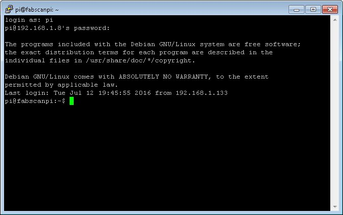

Now the console window opens and you must type in "**pi**" as **login-name** and "**raspberry**" as **password** (without the quotes). Now you should be able to see the login prompt (similar to the picture above).


**Connecting as Linux or OSX User (Terminal)**

Linux users can open a Terminal and type "**ssh pi@fabscanpi.local**"  ("**sh pi@ip-address-of-you-pi**"). 
Next you are asked for a password. Type in "**raspberry**" as **password** (without the quotes).
The next steps are described with screenshots for Putty, but the workflow is the same once the connection is 
established.

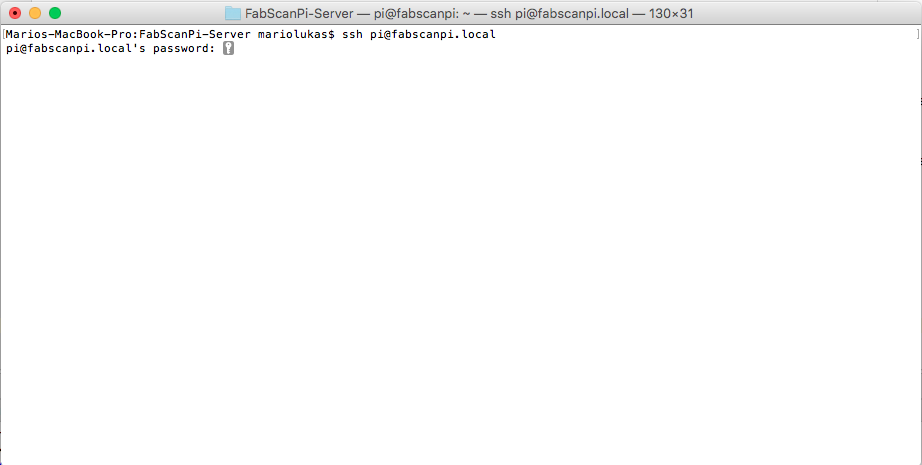

**Changing the config file.**

The config file is in a different folder, so you must change into that folder by entering the command:

cd /etc/fabscanpi/

and press ENTER.

To view and modify the config file (default.config.json) you must open it with an editor and using administrator rights to be able to save the changes into the same file. The editor which is already installed is called nano. So type in:

**sudo nano default.config.json**

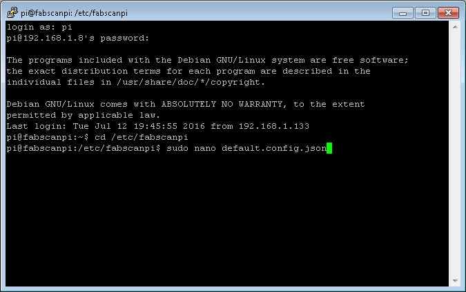

You have to enter the password "**raspberry**" (without the quotes) again, because you open the editor with administrator rights.

The nano-editor now displays the config-file and maybe you have to enlarge the window to have a better view.

Now you can perform the desired changes by using the keyboard. To navigate you have to use the up-, down-, left- and right-key.

 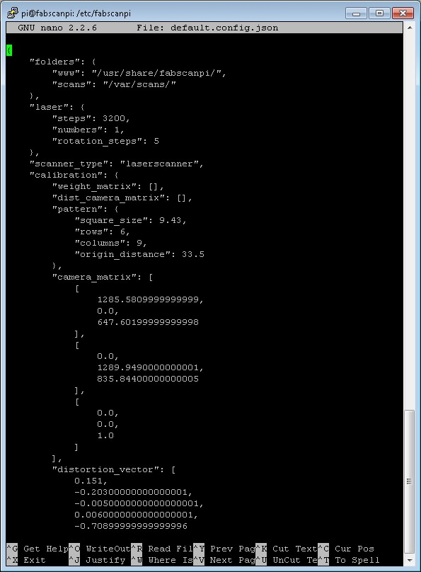

If you finished your modification press you can save the file by pressing and holding **CTRL** and **O** (german keyboard: STRG and O). Press RETURN to confirm the filename.

Now you can exit the editor by pressing and holding **CTRL** and **X** (german keyboard: STRG and X).

For the changes to take effect you must restart your FabScanPi by typing in the command

**sudo reboot**

and ENTER.


You can now close the PuTTY window.

The FabScanPi is rebooting and after a short time you can refresh your webbrowser and start using the FabScanPi with the new config settings.


### Troubleshooting

Can not connect to Arduino.
Is the Arduino connected to the USB port. Check the port in your fabscanpi-server configuration
file. Try another port e.g. /dev/ttyUSB0. 
More information about changing the configuration can be found in "FabScan Pi Configuration"
section.

Camera is not connected. 
Check the cable from the Raspberry Pi to the camera module. Be careful the cable can be very
fragil. Try another camera application for checking camera functionality e.g. [raspistill](https://www.raspberrypi.org/documentation/usage/camera/raspicam/raspistill.md).


# Setting up a WIFI connection

This description explains howto setup a wifi stick for raspbian. I prefer to use an EDIMAX dongle, it worked best for me. 
First plug in your wifi dongle and log in via ssh with password "raspberry" (without quotes):

```
ssh pi@<your-fabscanpi-ip>
```
First you have to activate the wifi option in your networking setup. 

```
sudo nano /etc/network/interfaces
```

Uncomment the folling lines and save the changes. 

``` 
auto wlan0
allow-hotplug wlan0
iface wlan0 inet dhcp
wpa-conf /etc/wpa_supplicant/wpa_supplicant.conf
iface default inet dhcp
```

Now restart your network adapters. 
```
sudo nano /etc/init.d/networking
```

If you type ```sudo ifconfig``` there should be a wlan0 connection in the list. 

Your fasbcanpi image is ready to go. The only things you have to do is open wpa_supplicant.conf and 
insert your wifi ssid and your wifi secret.

```
sudo nano /etc/wpa_supplicant/wpa_supplicant.conf
```


Save the file and try to connect to your wifi by typing the following command.
```
sudo ifup wlan0
```

In some cases you have to reboot the Raspberry Pi. Check if the wifi dongle's led is bliking.
If you want to change your Raspberry Pi to a fix wifi IP address you have to change the interfaces file
to get a static wifi connection.

```
sudo nano /etc/network/interfaces
```

Change the files content from 

```
auto lo
iface lo inet loopback

allow-hotplug eth0
iface eth0 inet dhcp

auto wlan0
allow-hotplug wlan0
iface wlan0 inet dhcp
wpa-conf /etc/wpa_supplicant/wpa_supplicant.conf
iface default inet dhcp
```

to 

```
auto lo
iface lo inet loopback

allow-hotplug eth0
iface eth0 inet dhcp

auto wlan0
allow-hotplug wlan0
iface wlan0 inet static
address <ip in your network>
netmask <your netmask>
gateway <your gateway>
wpa-conf /etc/wpa_supplicant/wpa_supplicant.conf
iface default inet dhcp
```

After you changed the file you can restart your network daemon.

```
sudo /etc/init.d/networking restart
```

#

# Software User Manual

* [Getting Started](#gettingStarted)

* [Presets](#presets)

* [Perform a scan](#performAScan)

* [Generate Mesh](#generateMesh)

* [File Operations](#fileOperations)

------

FabScan Pi is tested on: 

|                   Logo                   |      OS      |        Versions        |
| :--------------------------------------: | :----------: | :--------------------: |
|   | OSX, Windows | 47.0.2526.106 (64-bit) |
|  |     OSX      |         43.0.4         |
|  |   Windows    |      43.0.4, 47.0      |


**Getting Started<a name="gettingStarted"></a>**

- By default the FabScanPi server binds to all interfaces on port 8080. Pointing your browser to http://ip-of-your-raspberry-pi:8080 will open the user interface. 
  Note: Status messages will always appear in the upper left corner. 

- Right after the start you should see a notification about the camera status and one confirming that the FabScanPi HAT has been found. 
  Note: The messages will fade away after a short period of time.

  ​
  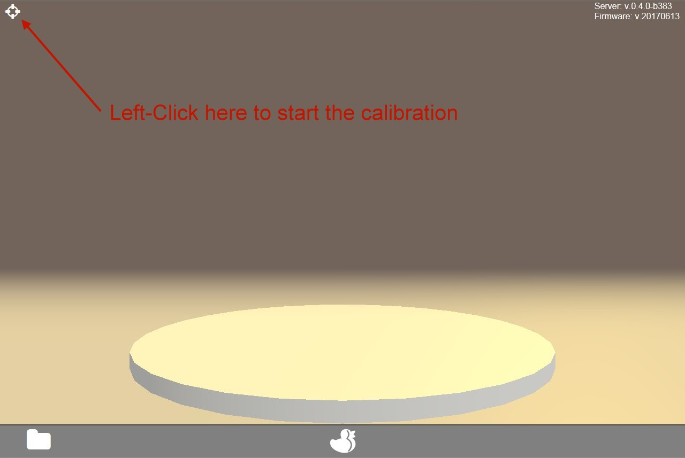

Now your FabScanPI is ready.

**Presets<a name="presets"></a>**

Note: The current settings are only persistent as long as the pi is up and running. The settings are saved with the scan data after a successful scan. They can be loaded to scan another object with the same settings. E.g. an object what consists of the same material, color etc. 

- Click on the duckling-symbol to open the scan menu.


- The threshold-slider (5) can be used to adjust the sensitivity of the captured data. Select the scan quality by using the other slider (6). 
  Note: The better the scan the longer is the required capture time. Sometimes it is better to start with a low resolution to control the selected settings result. If the result is nice you can perform a higher resolution scan with the same settings.

  ​
  

By clicking on the contrast-icon (3) you will get access to the camera settings menu. For adjusting the camera presets three sliders for saturation, brightness and contrast are available.


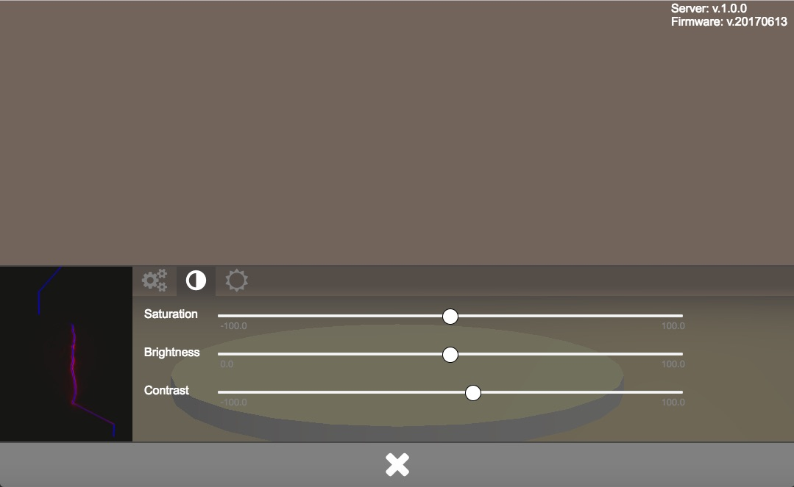


Click on the light-symbol (4) to get access to the lighting menu.


Here you can use the sliders to change the brightness and color of the (optional) light source. When all three sliders are at the very left end the light is off. Watch the preview in the lower left corner of the menu.
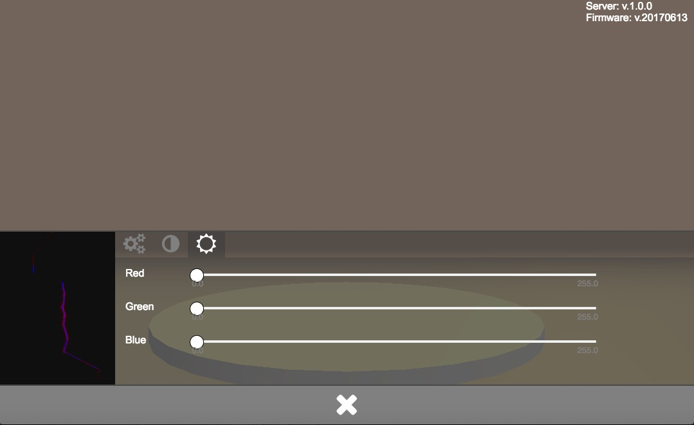


Note: The setting in the lighting menu will only cause an effect if an optional WS2812-compatible light source (e.g. Adafruit NeoPixel LED-Ring or FabScanPi-Camera-Holder) is installed.
Click on the  arrows-and-circle symbol (5) to get access to the alignment menu.


The preview in the lower left corner is showing the camera view completed with calibration bars. This preview must be used for aligning the camera after the assembly of the scanner. When the scan results are not flawless this menu can be used to check the correct adjustment.
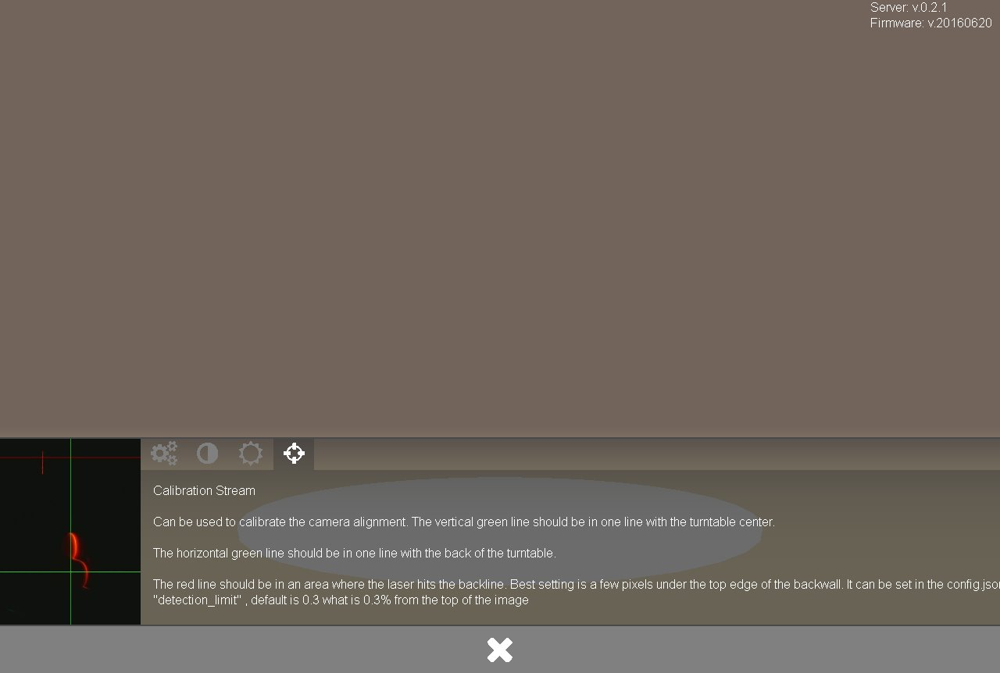


**Perform a scan<a name="performAScan"></a>**

**Color Scan**<a name="colorScan"></a>

- Make sure your FabScanPi is switched on, an object is placed on the turntable and the lid / the optional laser safety switch is closed.
- Open the web-interface as described in chapter 
  [Getting Started](#gettingStarted).
- Click on the duckling-symbol to open the scan menu.


Note: If you do not have installed a light source you should perform a [monochrome scan](#monochromeScan).

- Adjust the scan preset values to your needs as described in chapter [Presets](#presets).


- Click on “Start Scan” to initiate the process
  A starting message will be displayed. Now the texture will be processed.

  ​
  


The latest photo will be displayed during the capturing process.

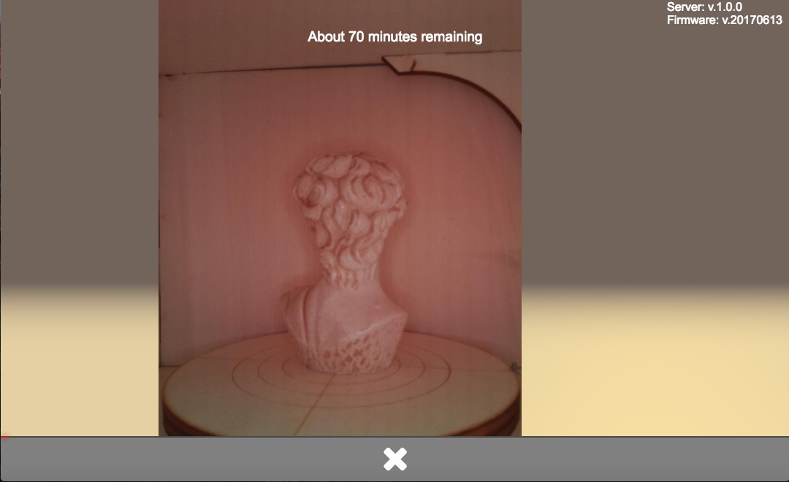


When the texture has been captured (progress bar at 50 percent) the actual scan is initiated. A notification is displayed.
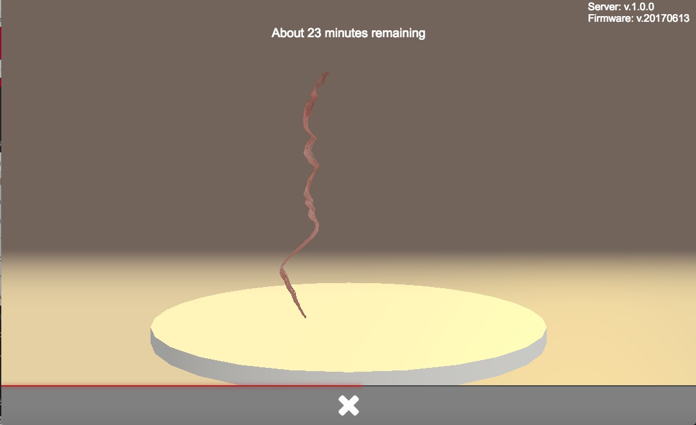


A notification will be displayed when the scan is completed / file is saved.
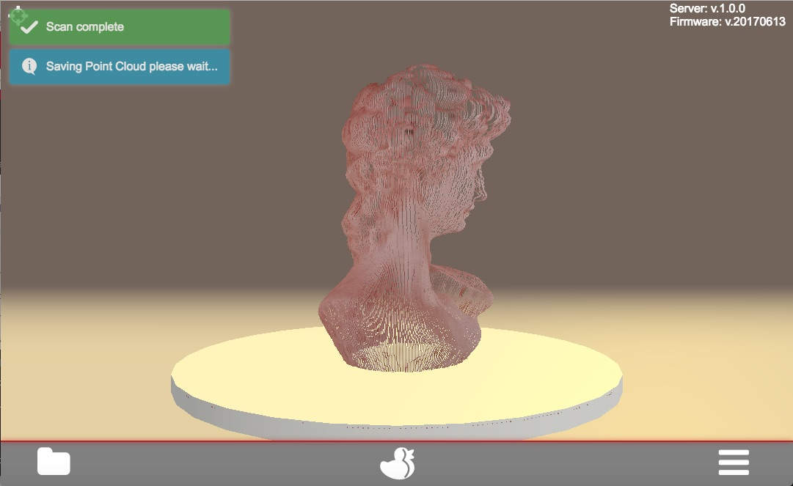


- You can now check, download or delete the scan-data.

  ​

**Monochrome scan**<a name="monochromeScan"></a>

- Make sure your FabScanPi is switched on, an object is placed on the turntable and the lid / the optional laser safety switch is closed.
- Open the web-interface as described in chapter 
  [Getting Started](#gettingStarted).
- Click on the duckling-symbol to open the scan menu.


- Adjust the scan preset values to your needs as described in chapter [Presets](#presets).
- Uncheck the color-scan option (8)


- Click on “Start Scan” to initiate the process
  A starting message will be displayed and the scan process is started.


When the scan is completed / file is saved a notification will be displayed. 
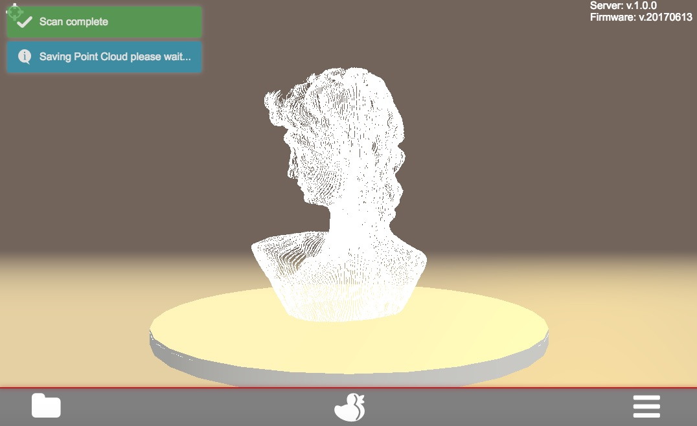


- You can now check, download or delete the scan-data.


** Generate Mesh<a name="generateMesh"></a>

The FabScanPi software includes a feature to convert a scan into a mesh-file. This mesh-file can be used for 3D-printing.
Note: To generate a mesh-file a scan must have been performed. It is also possible to load a scan-file which has been saved previously. 


** File Operations<a name="fileOperations"></a>

- Load files<a name="loadFiles"></a>

A scan result which has been saved to the FabScanPi memory previously can be reloaded. Go to the main menu and click on the folder-icon at the left side of the menu bar.


- Scroll through the displayed file inventory and click on the icon of the wanted file.

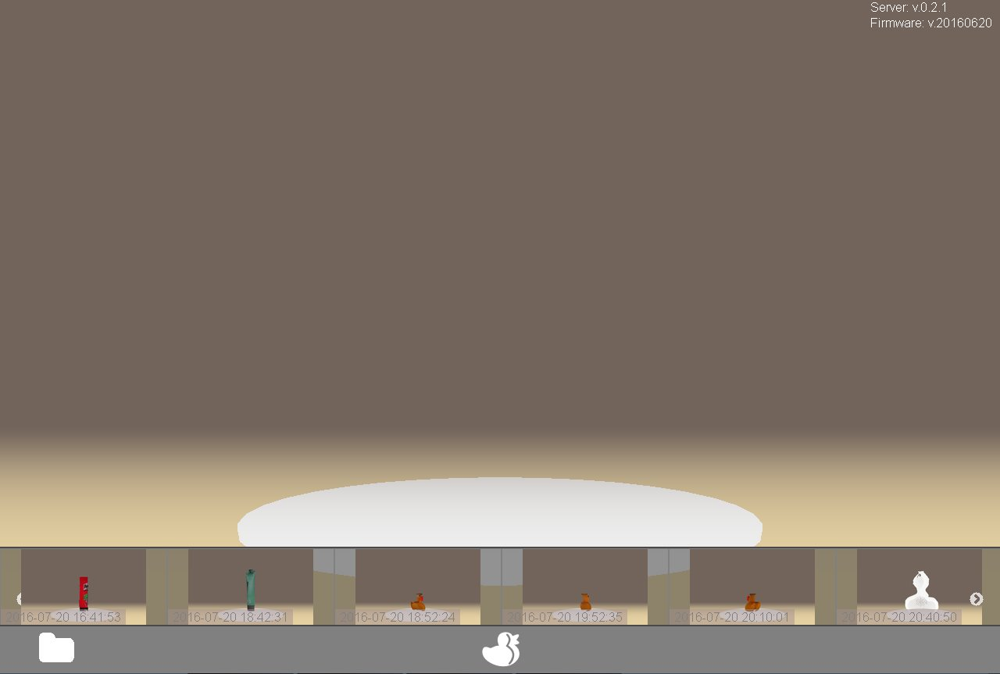


Now the selected file will be loaded which may need some time. After the loading process is finished a notification will be displayed.


- Delete files<a name="deleteFiles"></a>

**Delete a scan-file**
A scan result which has been saved to the FabScanPi memory previously can be deleted. To do that it must be loaded and displayed on the virtual turntable in the main menu.
-Click on the options-icon on the right side of the menu bar.


Click on the wastebasket-icon to delete the scan-file.
NOTE: By deleting a scan file the corresponding mesh file (if available) will be deleted instantly.


**Delete a mesh-file**
Note: If a mesh file is available a second slide for the mesh file will be displayed.


By selecting the mesh slide and clicking on the wastebasket-icon the mesh-file can be deleted separately. 
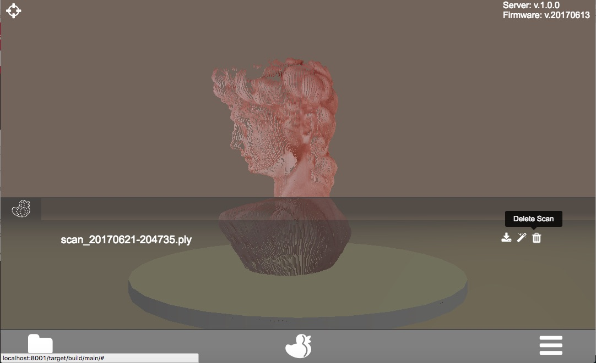

- Download Files<a name="downloadFiles"></a>
  It is possible to download generated files (either scan- or mesh-files) from the FabScanPi via the web-based user interface. 

  ​

**Scan-file**
Note: Before you can download a file it must be [loaded](#loadFiles) and displayed on the virtual turntable in the main menu.

- Go to the main menu.

- Click on the options-icon on the right side of the menu bar.

  ​
  

- Click on the download-icon to download the mesh-file

- A download message (depending on the used web-browser) will be displayed

  ​

**Mesh-file**
Note: If a mesh file is available a second slide for the mesh file will be displayed.


- Select the mesh slide
- Click on the download-icon to download the mesh-file
- A download message (depending on the used web-browser) will be displayed

